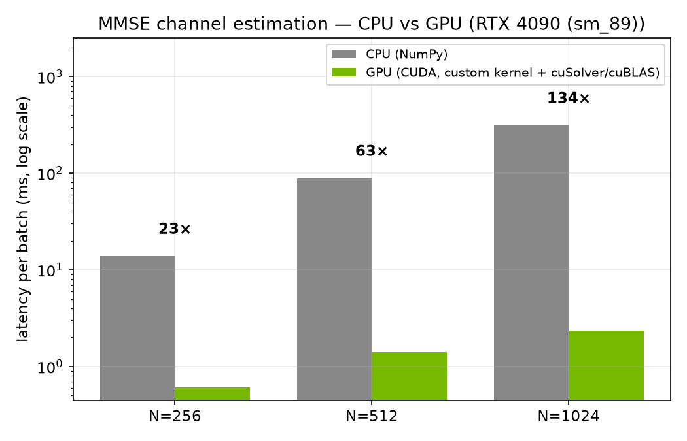
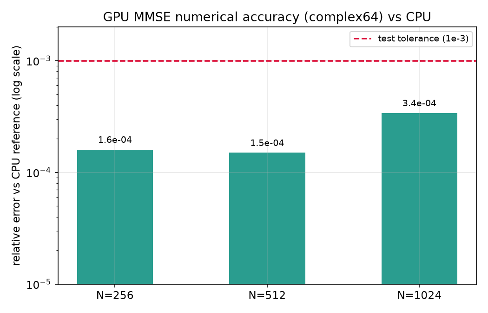
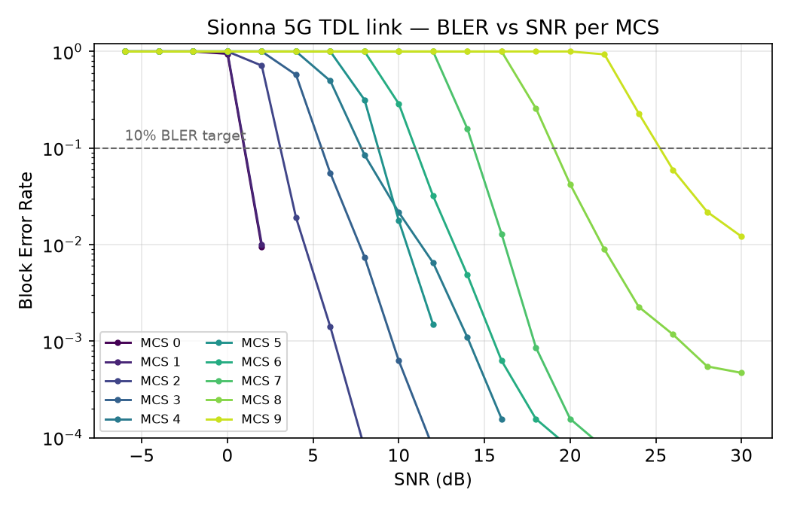
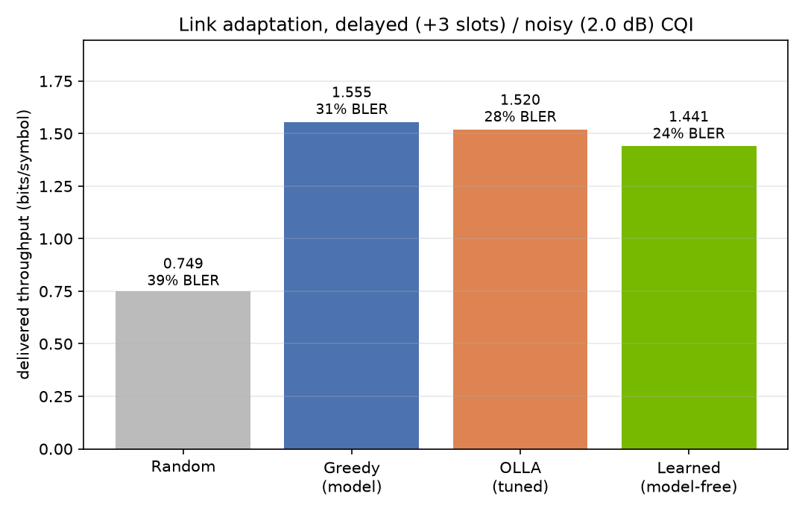

# OFDM PHY + AI-RAN Lab

[](https://github.com/kabNath/gpu-accelerated-ai-ran-phy-lab/actions/workflows/tests.yml)


A compact, honest wireless-PHY research stack for AI-RAN / 6G work:

- **GPU-accelerated MMSE channel estimation** with hand-written CUDA kernels +
  cuSolver/cuBLAS — **up to 133× faster than NumPy** on an RTX 4090, verified
  correct against a CPU reference (~1e-4 relative error).
- **A 5G link-level BLER simulator** (NVIDIA Sionna): OFDM + 5G LDPC over a
  3GPP TR38.901 TDL channel, swept over MCS × SNR.
- **Link adaptation** on the measured BLER curves: OLLA baseline, a model-based
  greedy, and a **model-free learned policy** that uses only ACK/NACK feedback
  (a deep-RL PPO agent is included as a scaffold for the stateful extension).

The goal isn't to replace a production 5G NR stack — it's to show end-to-end
engineering judgment: real GPU kernels, a verifiable CPU ground truth, a
standards-based link, and honest limitations. Design rationale and a
claim-by-claim verification guide are in
[`docs/NVIDIA_REVIEW.md`](docs/NVIDIA_REVIEW.md); status and next steps in
[`ROADMAP.md`](ROADMAP.md).

> **Companion repo:** the GPU-kernel deep-dive (naive → shared-memory tiled →
> cuBLAS, profiled with Nsight Compute) lives in
> [cuda-phy-channel-estimation](https://github.com/kabNath/cuda-phy-channel-estimation).

---

## 1. GPU-accelerated MMSE channel estimation

`H_mmse = R (R + σ²I)⁻¹ H_ls`, with `R` built from a power-delay profile.

The pipeline never forms the Wiener matrix explicitly: it builds `R` with a
**custom CUDA kernel**, solves the Hermitian system with **cuSolver**
(`Cpotrf`/`Cpotrs`), and applies `R` with **cuBLAS** (`Cgemm`). Re-implementing
a dense Cholesky by hand would be slower and less numerically robust than the
vendor libraries — knowing *when not* to write a kernel is part of the point.

### Measured on RTX 4090 (sm_89, CUDA 12.8, driver 596.36)

| N (subcarriers) | CPU (NumPy) | GPU | **Speedup** | rel. error vs CPU |
|---:|---:|---:|---:|---:|
| 256  | 13.9 ms | 0.61 ms | **22.8×** | 1.6e-4 |
| 512  | 88.9 ms | 1.40 ms | **63.4×** | 1.5e-4 |
| 1024 | 313 ms  | 2.35 ms | **133.6×** | 3.4e-4 |





The speedup grows with N because the O(N³) solve dominates — exactly where the
GPU pays off. Numbers are reproduced by `benchmarks/benchmark_cpu_gpu.py`;
correctness is enforced in `tests/test_cuda_mmse.py` (GPU vs CPU and the compiled
binary vs CPU). Regenerate the figures with `python benchmarks/make_figures.py`.

```bash
make -C csrc ARCH=sm_89                  # sm_80 A100, sm_75 T4
csrc/mmse_est --bench --n 1024 --B 4096
python benchmarks/benchmark_cpu_gpu.py --sizes 256 512 1024
```

---

## 2. Sionna 5G BLER link

A SISO OFDM link built with **NVIDIA Sionna (PHY 1.x)**:

- 5G LDPC encoder/decoder, QAM mapping (QPSK→256QAM)
- OFDM resource grid (128 subcarriers, 14 symbols, 30 kHz SCS, Kronecker pilots)
- 3GPP TR38.901 **TDL-A** channel (100 ns delay spread, 3 m/s)
- LS channel estimation + LMMSE equalization + APP demapping

`benchmarks/run_sionna_bler.py` sweeps the **block-error rate over MCS × SNR**
with `sim_ber` and exports `results/sionna_bler_curves.json`.



```bash
pip install -r requirements-sionna.txt   # Sionna PHY 1.x + TensorFlow (GPU)
python benchmarks/run_sionna_bler.py     # writes results/sionna_bler_curves.json
```

Standards detail handled honestly: the 5G LDPC code supports coderates in
`[1/5, 8/9]` and ≤ 8448 information bits per codeword. MCS below 1/5 are clamped
to 1/5, and the highest-order MCS (256QAM) is capped at 8448 info bits
(effective rate ≈ 0.69 instead of 0.75) rather than segmented into multiple
code blocks.

---

## 3. Link adaptation on the measured BLER curves

`airan_phy_lab/bler_table.py` loads the swept curves and exposes
`bler(snr_db, mcs)` plus `best_mcs(snr_db, target_bler)`, with a transparent
fallback to the analytic model when the curves file is absent
(`load_or_synthetic(...).source` reports `"sionna"` vs `"synthetic"`).

`experiments/la_compare.py` compares four MCS-selection policies on a
non-stationary SNR trace with **delayed (+3 slots) and noisy (2 dB) CQI** — the
regime where adaptation matters. `random`, `greedy` and `olla` use the BLER
curves as a model; the **learned** policy is a model-free contextual bandit that
sees only ACK/NACK feedback, never the curves.



| policy | throughput (bits/sym) | achieved BLER |
|---|---:|---:|
| Random | 0.75 | 38.8% |
| Greedy (model) | 1.56 | 31.4% |
| OLLA (tuned) | 1.52 | 27.7% |
| **Learned (model-free)** | 1.44 | **23.8%** |

The model-free agent recovers **~93%** of the model-based greedy's throughput
and **~95%** of the tuned OLLA's, **while achieving the lowest block-error rate
(23.8%)** — using only ACK/NACK feedback, never the channel model. Greedy wins
raw throughput by trusting the (noisy, delayed) CQI most aggressively; the
learned policy independently settles on a more conservative, more reliable
operating point. Under HARQ, where each retransmission costs a slot (not modelled
here), that reliability gap would partly close the throughput difference.

```bash
python experiments/la_compare.py     # writes results/la_results.json + the figure above
```

**Honest scope:** a memoryless/lightly-contextual policy cannot dramatically beat
a model-based controller sharing the same observation — so this is framed as
*matching* tuned/industrial baselines from feedback alone, **not** "RL beats
OLLA". Larger gains need temporal structure (HARQ value, fading prediction); the
stateful PPO agent in `airan_phy_lab/ppo_link_adaptation.py` is the scaffold for
that direction — see [`ROADMAP.md`](ROADMAP.md).

---

## Repository layout

```
airan_phy_lab/
  ofdm.py, modulation.py, channel.py, estimators.py   # classical PHY + LS/MMSE
  cuda/mmse_kernels.py                                 # CuPy RawKernels (real PHY work)
  sionna_link.py                                       # 5G TDL OFDM + LDPC BLER link
  bler_table.py                                        # Sionna curves -> OLLA/bandit/PPO bridge
  link_adaptation.py, ppo_link_adaptation.py           # OLLA + PPO
csrc/mmse_channel_est.cu                               # standalone CUDA C++ (cuSolver/cuBLAS)
benchmarks/                                            # CPU-vs-GPU, Sionna sweep, figures
experiments/la_compare.py                              # OLLA/greedy/random/learned comparison
results/                                               # measured benchmarks, BLER curves, figures
docs/NVIDIA_REVIEW.md                                  # design choices + verification + limits
tests/                                                 # CPU + GPU correctness (GPU self-skips)
.github/workflows/tests.yml                            # CI: CPU tests + CUDA compile-check
```

## Setup notes

- GPU work (CUDA build, CuPy, TensorFlow/Sionna) runs on Linux or **WSL2**
  (TensorFlow has no native-Windows GPU support since 2.11). Keep Sionna in its
  own venv to avoid a numpy conflict with CuPy.
- CI runs CPU tests on every push and **compile-checks the CUDA** (no GPU needed
  on the runner); GPU tests self-skip when no GPU is present.

## Limitations

SISO link, single LDPC codeword (no code-block segmentation), TDL (not
ray-traced) channel, and a simplified MCS table. Link-adaptation results assume
no HARQ retransmission combining. These are natural next extensions, not hidden
assumptions — see [`ROADMAP.md`](ROADMAP.md).

## License

MIT.
